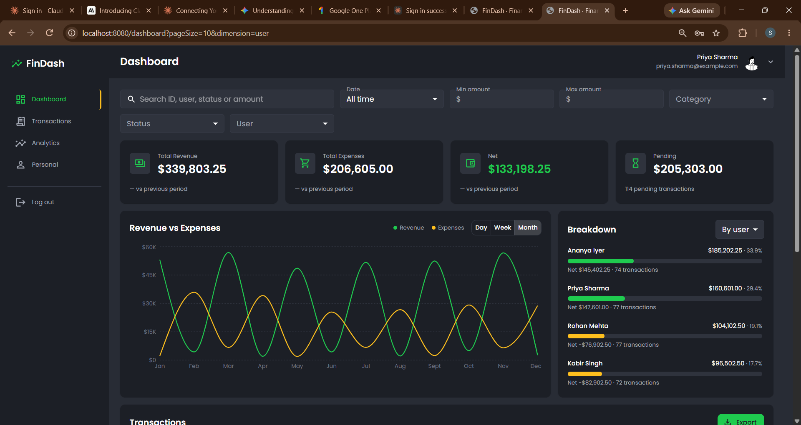
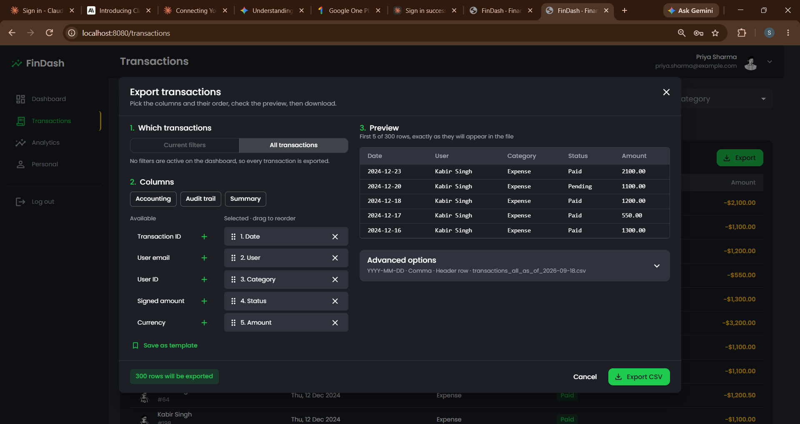
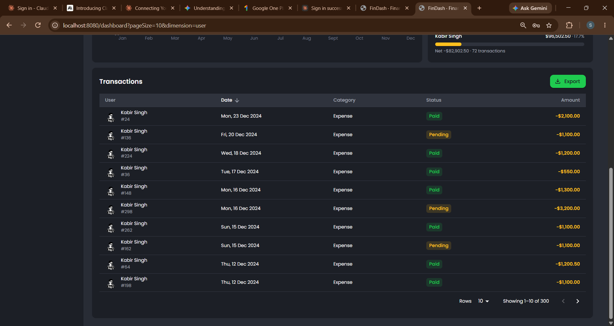
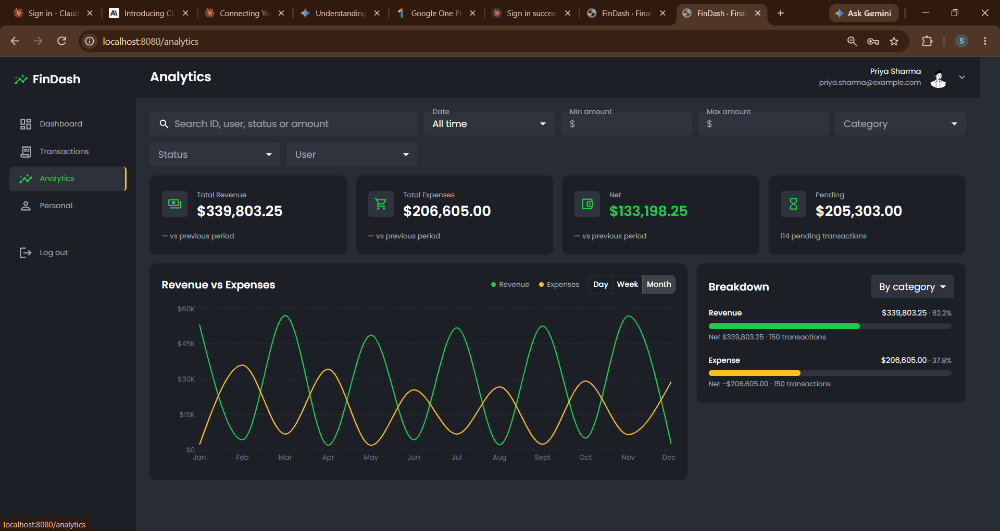
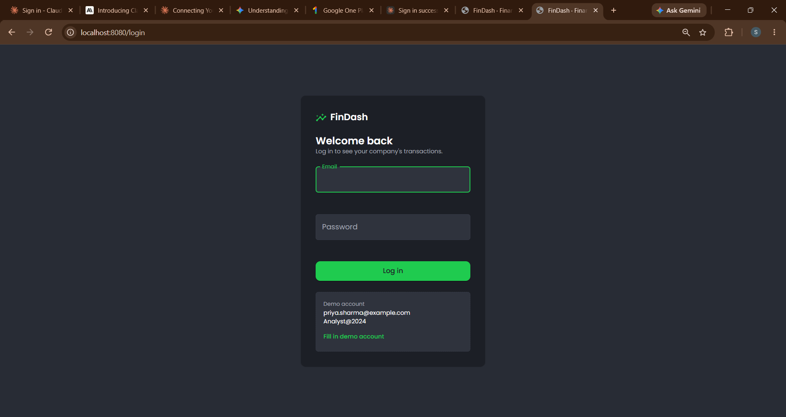

# FinDash — Financial Analytics Dashboard

[](https://github.com/shuddhay-ios/finance_dashboard/actions/workflows/ci.yml)

A full-stack dashboard for a finance team: JWT login, headline metrics, revenue-vs-expense
trends, a searchable and sortable transaction table, and a CSV export where the user picks the
columns **and their order** and the file downloads straight through the browser.

Built for the Loopr AI full-stack assignment, on the provided 300-record dataset.

**Stack:** NestJS 11 · MongoDB 7 (Mongoose 8) · zod · React 18 + Vite · MUI 5 · TanStack Query ·
Recharts · Docker

---

## Highlights for reviewers

**Code quality**

- One source of truth: request/response schemas, money conversion and CSV cell formatting live in
  `packages/shared`, so the API validates and the web app types itself from the same code.
- **222 tests** (unit, integration against a real in-memory MongoDB, and component tests). Expected
  values come from the raw dataset, not from application code, so a test can't agree with a bug.
- Lint, formatting, strict types, tests, a production build and both Docker images run in CI on
  every push.
- 80 small conventional commits, a decision log in [`docs/decisions.md`](docs/decisions.md) that
  records the alternative for every choice, and Docker images that run as a non-root user.

**Problem-solving approach**

- The dataset was analysed **before any code**: eight findings, each one changing the design (see
  [What the data told us](#what-the-data-told-us)).
- Money is stored as **integer cents**, because `19.99 * 100` is `1998.9999999999998` in JavaScript
  and a finance app can't drift.
- Filtering is written **once**, as a pure function every endpoint uses, so the table, the charts and
  the export can never disagree.
- Four real bugs found and fixed during development, each with a test
  ([Problems found and fixed](#problems-found-and-fixed)).

**Creativity**

- The breakdown chart has a **switchable dimension** (category / status / user / month), because the
  data has only two categories and a fixed pie chart would say nothing.
- The export modal has **drag-to-reorder columns, presets, saved templates and a live preview of the
  first five real rows**, rendered by the same code that writes the file.
- Downloads use a **single-use token valid for 60 seconds**, so the browser performs a real streamed
  download instead of building the file in memory.
- Small touches from thinking about the reader of the file: a signed-amount column for accountants,
  file names that describe their period, CSV injection protection, and a UTF-8 BOM so Excel shows
  non-English names correctly.

---

## Screenshots

|                                                    |                                                    |
| -------------------------------------------------- | -------------------------------------------------- |
|        |        |
| Dashboard: filters, metric cards, trend, breakdown | Export: drag-to-reorder columns and a live preview |
|  |        |
| Transaction table with sorting and paging          | Analytics page                                     |



---

## Demo login

Any of the four seeded users, all with the password **`Analyst@2024`**:

`priya.sharma@example.com` · `rohan.mehta@example.com` · `ananya.iyer@example.com` ·
`kabir.singh@example.com`

The login page also has a **"Fill in demo account"** button.

---

## Run it in one command

Requires [Docker](https://www.docker.com/products/docker-desktop/).

```bash
git clone https://github.com/shuddhay-ios/finance_dashboard.git
cd finance_dashboard
cp .env.example .env
docker compose up --build
```

This starts MongoDB, loads the 300 transactions once, then the API and the web app:

| URL                                       | What                                             |
| ----------------------------------------- | ------------------------------------------------ |
| **http://localhost:8080**                 | **The app** — log in with the demo account above |
| http://localhost:3000/api/docs            | Swagger API documentation                        |
| http://localhost:3000/api/v1/health/ready | `{"status":"ok","database":"up"}`                |

Stop with `docker compose down` (add `-v` to wipe the database and re-seed next time).

### Running for development (without Docker)

Requires Node 22+, pnpm 10 and a reachable MongoDB (the compose `mongo` service works).

```bash
pnpm install
cp .env.example .env
pnpm --filter @finance/api seed     # loads the dataset and creates all indexes
pnpm --filter @finance/api dev      # API on http://localhost:3000
pnpm --filter @finance/web dev      # web app on http://localhost:5173 (proxies /api)
```

### Checks

```bash
pnpm lint        # ESLint, type-aware rules
pnpm typecheck   # TypeScript, strict
pnpm test        # 222 tests: 25 shared, 142 API, 55 web
pnpm build       # production build of every package
```

---

## What the data told us

Findings from the provided `transactions.json` and the decision each one led to. Reading the
data first changed the design in several places.

| #   | Finding                                                                                             | Why it matters                                                                               | Decision                                                                                        |
| --- | --------------------------------------------------------------------------------------------------- | -------------------------------------------------------------------------------------------- | ----------------------------------------------------------------------------------------------- |
| D-1 | `category` has only 2 values (Revenue 150 / Expense 150)                                            | A category pie chart would be two equal slices                                               | Breakdown panel with a **switchable dimension**: category / status / user / month               |
| D-2 | `user_profile` is the same URL on all 300 rows, and that site returns a new random face per request | Avatars would change on every render and identify nobody                                     | Seed a real `users` collection from the 4 distinct `user_id`s with deterministic avatars        |
| D-3 | `amount` is a float (`1200.5`)                                                                      | Floating point can't represent most decimals exactly (`19.99 * 100` is `1998.9999999999998`) | Store `amountMinor` as **integer cents**; convert only at the display edge                      |
| D-4 | No description, merchant or currency field                                                          | "Search across fields" can't mean free-text search                                           | Search id, user name/email/id, category, status, plus exact amount — and the search box says so |
| D-5 | `id` is a plain integer 1–300                                                                       | Would clash with MongoDB's `_id`                                                             | Keep it as `externalId` with a unique index; the seed upserts on it                             |
| D-6 | Only 4 distinct users                                                                               | The user filter is small but real                                                            | Keep it; it makes the by-user breakdown meaningful                                              |
| D-7 | All dates are in 2024; every month has 23–29 rows, but only **221 of 366 days** have any            | A daily chart would silently skip days                                                       | **Gap-fill** every period server-side so empty days render as zero                              |
| D-8 | `status` is only Paid / Pending, and **35 transactions are exactly $1,500**                         | Sorting by amount has ties, so pages could overlap                                           | Closed enum for status; every sort adds `_id` as a tiebreaker                                   |

---

## Features

### Authentication

- Login, logout and silent session restore; passwords hashed with **argon2id**.
- 15-minute access token in memory (never `localStorage`) + 7-day refresh token in an
  `httpOnly`, `Secure`, `SameSite=Strict` cookie scoped to the auth routes.
- **Refresh token rotation with reuse detection:** every refresh token works once; replaying an
  old one revokes the whole session family. Only SHA-256 hashes are stored.
- Locked by default: a global guard protects every route, and routes opt out with `@Public()`.
- No user enumeration (identical response and timing for wrong email vs wrong password) and a
  login rate limit of 5 attempts per minute per IP.

### Dashboard

- Four metric cards: revenue, expenses, net (green/red) and pending amount + count, each with
  **% change against the previous equal-length period** (never `Infinity`; `—` when there's
  nothing to compare).
- Revenue-vs-expense trend with **Day / Week / Month** granularity, empty periods filled with
  zero, and a tooltip showing both values and the net.
- Breakdown by category / status / user / month, where **percentages always add to exactly 100**
  (largest remainder method).

### Transactions

- Server-side search, filtering, sorting and pagination (10 / 25 / 50, "Showing 1–25 of 300").
- Filters: search (debounced, regex-escaped), date range with presets, amount range, and
  multi-select category / status / user. Several values of one filter are OR; different filters
  are AND.
- **Every filter lives in the URL**, so a view is shareable, survives a refresh and works with
  the Back button.
- Stable sorting: every sort adds `_id`, so no row is ever repeated or skipped across pages.
- Skeleton loaders, a real empty state with "Clear filters", and stacked cards under 768px.

### CSV export

- Two-pane column picker with **drag-to-reorder** (keyboard accessible), presets
  (Accounting / Audit trail / Summary) and **user-saved templates**.
- **Live preview of the first 5 real rows**, rendered by the same shared formatting code the
  server uses, so the preview cannot disagree with the file.
- Advanced options: date format, delimiter (comma / semicolon / tab), header row on/off, and a
  file-name template with placeholders (`transactions_2024-01-01_to_2024-03-31.csv`).
- **Two-step download:** `POST /exports` returns a random, single-use token valid for 60 seconds;
  the browser then navigates to the download URL and the API **streams** the file, so the browser
  performs a real native download and memory stays flat.
- RFC 4180 quoting, CRLF, UTF-8 BOM for Excel, and **CSV injection protection** (cells starting
  with `= + - @` are neutralised).

### Profile

- Change display name; upload a profile photo (resized to 256×256 in the browser) or remove it.
- The server enforces a 2 MB limit and verifies the file's **magic bytes**, so a renamed
  non-image is rejected.

### Errors, logging and health

- One error envelope everywhere: `{ code, message, details, requestId }` with stable codes the
  web app maps to friendly **alert chips** (max 3, auto-dismiss, Retry on network errors).
- Unexpected errors never leak internals; the request id ties a user report to the logs.
- Structured JSON logs (pino) with tokens, cookies and download links redacted.
- Separate liveness and readiness endpoints.

---

## API

Base path `/api/v1`. Everything except the health checks and the download link requires
`Authorization: Bearer <accessToken>`.

| Method               | Path                            | What it does                                                                    |
| -------------------- | ------------------------------- | ------------------------------------------------------------------------------- |
| POST                 | `/auth/login`                   | `{ email, password }` → `{ accessToken, user }` + refresh cookie (5/min per IP) |
| POST                 | `/auth/refresh`                 | New access token; rotates the refresh cookie                                    |
| POST                 | `/auth/logout`                  | Ends the session and clears the cookie                                          |
| GET                  | `/auth/me`                      | The logged-in user                                                              |
| GET                  | `/transactions`                 | Filter, search, sort, paginate                                                  |
| GET                  | `/analytics/summary`            | Totals, pending, and deltas vs the previous period                              |
| GET                  | `/analytics/trends`             | Revenue/expense per `day`/`week`/`month`, gap-filled                            |
| GET                  | `/analytics/breakdown`          | Totals by `category`/`status`/`user`/`month`                                    |
| POST                 | `/exports`                      | Save an export configuration → single-use download token                        |
| GET                  | `/exports/:token/download`      | Streamed CSV (`Content-Disposition: attachment`)                                |
| GET · POST           | `/export-templates`             | List / save column layouts                                                      |
| GET                  | `/users`                        | The people who own transactions (for the filter)                                |
| PATCH · PUT · DELETE | `/users/me`, `/users/me/avatar` | Profile name and photo                                                          |
| GET                  | `/health`, `/health/ready`      | Liveness / readiness                                                            |

Shared filter parameters: `search`, `dateFrom`, `dateTo`, `amountMin`, `amountMax`, `category`,
`status`, `userId` (repeat a key for several values). The list adds `page`, `limit` (max 100),
`sortBy` (`date`/`amount`/`category`/`status`/`user`) and `sortDir`.

```bash
# log in
curl -X POST http://localhost:3000/api/v1/auth/login \
  -H 'content-type: application/json' \
  -d '{"email":"priya.sharma@example.com","password":"Analyst@2024"}'

# the 5 largest pending transactions
curl 'http://localhost:3000/api/v1/transactions?status=Pending&sortBy=amount&sortDir=desc&limit=5' \
  -H 'Authorization: Bearer <accessToken>'
```

Interactive docs, generated from the same zod schemas that validate the traffic:
**http://localhost:3000/api/docs**

---

## Architecture

```
Browser
  │  one origin: nginx (Docker) or a Vercel rewrite forwards /api
  ▼
React 18 + Vite + MUI          access token in memory · filters in the URL
  │  REST + JSON               refresh cookie: httpOnly, Secure, SameSite=Strict
  ▼
NestJS 11 API
  ├── auth         login, refresh rotation with reuse detection, global guard
  ├── transactions buildTransactionMatch() — the single filter translator
  ├── analytics    summary, gap-filled trends, breakdown
  ├── exports      config → single-use token → streamed CSV, templates
  ├── users        directory, profile name and photo
  └── common       error envelope, pino logging, zod-validated env
  │  Mongoose
  ▼
MongoDB 7          users · transactions · sessions · export_jobs · export_templates · user_avatars
```

```
apps/api            NestJS API
apps/web            React web app
packages/shared     zod schemas, types, money and CSV formatting used by both
docs/decisions.md   why each choice was made, and the alternative
```

**Why `packages/shared` matters:** request and response shapes, money conversion and CSV cell
formatting are defined **once**. The API validates with them, the web app derives its types from
them, and the export preview uses the very same formatting code as the file writer. Rename a
field and the frontend fails to compile instead of breaking at runtime.

**The one design decision that matters most:** filtering is written once, as a pure function
`buildTransactionMatch(filters, users)`. The table, all three analytics endpoints and the CSV
export call it, so "export what you're looking at" and "the cards agree with the table" are true
by construction. There is exactly one place to test, and one place to fix a filter bug.

---

## Testing and quality

| Layer       | Tool                                | Covers                                                                                                        |
| ----------- | ----------------------------------- | ------------------------------------------------------------------------------------------------------------- |
| Unit        | Vitest                              | Filter translation, money conversion, period maths, percentages, CSV writing, filenames, image type detection |
| Integration | Supertest + `mongodb-memory-server` | Every endpoint against a real MongoDB loaded with the real 300 rows                                           |
| Component   | Testing Library                     | Login page, transaction table, export modal, profile page                                                     |

**222 tests**, all run in CI along with lint, formatting, type checks, a production build and both
Docker image builds. Expected values in the data tests are computed from the raw JSON file, not
from application code, so the tests can't agree with a bug.

Notable cases: no row repeats or disappears across all 43 pages when 35 amounts tie · wrong
password and unknown email are indistinguishable · a replayed refresh token ends the session ·
a reused or expired download link is refused · a text file renamed `photo.png` is rejected ·
searching `.*` is literal · percentages sum to exactly 100.

---

## Problems found and fixed

Four bugs caught during development. Each one has a test so it cannot come back.

| Problem                                                   | How it showed up                                       | Cause                                                                                                                                 | Fix                                                                                                                     |
| --------------------------------------------------------- | ------------------------------------------------------ | ------------------------------------------------------------------------------------------------------------------------------------- | ----------------------------------------------------------------------------------------------------------------------- |
| **A value containing a line break would split a CSV row** | Found by testing `csv-stringify` before trusting it    | With Windows line endings the library quotes values containing `                                                                      |
| `, but not a lone `                                       |
| `                                                         | Force quoting for `                                    |
| `and`                                                     |
| ` (`quoted_match`), covered by a unit test                |
| **Duplicate export template names were accepted**         | An integration test expected a 400 and got a 201       | The uniqueness rule is a database index, and the new collection's indexes were never created (the API starts with `autoIndex: false`) | One `syncAllIndexes()` listing every collection, run by the seed and by the tests                                       |
| **Back button stepped through half-typed searches**       | Found while clicking around the running app            | Each debounced search commit pushed a history entry, so "p" and "priya" were separate steps                                           | Starting or clearing a text filter pushes a history entry; refining one replaces it (`isRefiningText`, unit tested)     |
| **Tests passed locally but timed out in CI**              | GitHub Actions failed with "Hook timed out in 60000ms" | Each integration file starts its own in-memory MongoDB; on a 2-core runner they started in parallel and exceeded the timeout          | Test files run one at a time when `CI` is set, with a longer start-up allowance; unchanged (and still parallel) locally |

## Out of scope (deliberately)

Creating, editing or deleting transactions · self-registration, password reset and email ·
multi-currency and multi-tenancy · roles beyond analyst · caching (unnecessary at 300 rows) ·
Kubernetes/Terraform.

## What I'd do next

- Playwright end-to-end smoke test (login → filter → export → file downloaded).
- Cursor-based pagination and a denormalised user name once the table grows past ~100k rows;
  a text index for search.
- Redis for the login rate limit when running more than one API instance.
- Object storage (S3) for profile photos instead of MongoDB.
- Deploy to Render + Vercel + MongoDB Atlas (config for both is in `render.yaml` and
  `vercel.json`).
